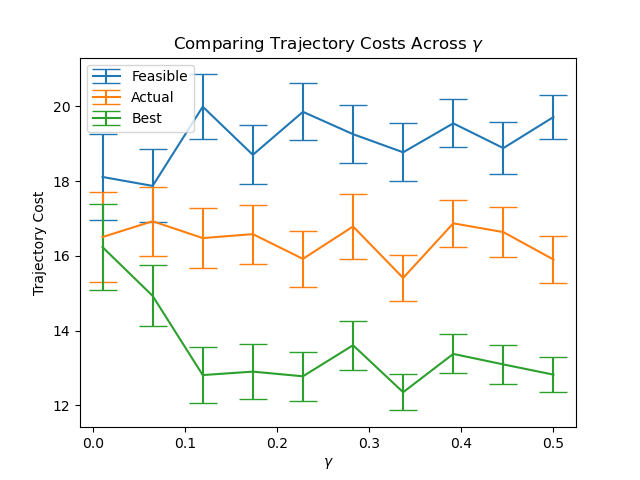

# Bayesian Planning Under Wind Uncertainty

This project studies receding-horizon planning when an agent must navigate a grid environment with an initially unknown wind field. The agent updates its belief about the latent wind correlation parameter as it moves, samples posterior wind fields, and replans using the current posterior.

The code was developed for Stanford AA228: Decision Making Under Uncertainty.

## Problem

The agent starts with a prior over a Gaussian-process-like wind model on a grid with obstacles. As the agent moves, it receives local wind observations, updates its posterior, and chooses the next action by comparing candidate paths under sampled wind fields.

The goal is to understand how online Bayesian updating improves path selection relative to static feasible paths and the full-information best path.

## Methods

- Bayesian recursive updates over a discretized latent wind correlation parameter
- Conditional Gaussian inference for unobserved wind values given local measurements
- Posterior sampling of complete wind fields
- Receding-horizon replanning after each new observation
- Suboptimality and trajectory-cost comparisons against feasible and best-path baselines

## Repository Structure

- `bayesian_updating.py`: posterior updates and wind-field sampling utilities
- `receding_horizon_control.py`: online observe-update-plan loop
- `find_one_path.py`: path search and path-cost helpers
- `env.py`: environment dynamics, obstacle handling, and path-cost evaluation
- `env_gen.py`: environment generation and visualization helpers
- `suboptimality_study.py`: experiments comparing actual, feasible, and best-path costs
- `plots/`: saved trajectory-cost comparison figures

## Example Output

The project compares receding-horizon trajectories with baseline paths and visualizes cost differences across trials.



## How to Run

Install the Python dependencies:

```bash
pip install numpy scipy matplotlib
```

Run the receding-horizon planning demo:

```bash
python receding_horizon_control.py
```

Run the suboptimality study:

```bash
python suboptimality_study.py
```

## Notes

This is a research/course project rather than a packaged library. The code emphasizes modeling, inference, and experimental comparison over production interfaces.
